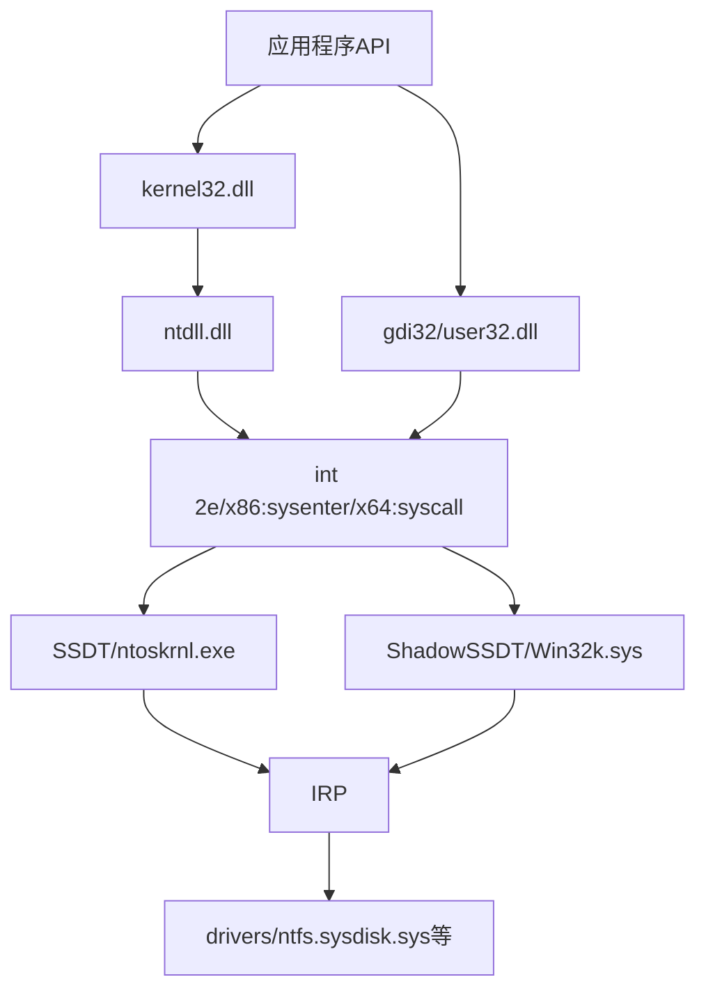

在windows进行开发时，应用层或内核层所使用的API函数最终都会进入到内核当中，学习记录一下这个过程总所涉及到的相关知识。<!--more-->
## API
windows API是被封装在系统的dll文件当中的，系统功能相关的API封装在kernel32.dll当中，与图形界面相关的封装在gdi32.dll当中，与用户相关的封装在user32.dll当中。而在考虑从应用层到内核层的调用时，它们被为两类:
- kernel32.dll：这类API会进一步封装ntdll.dll，由ntdll.dll当中进入内核，进入内核后使用SSDT表（ntoskrnl.exe）
- gdi33.dll/user32.dll：这类API直接进入内核，进入内核后使用Shadow SSDT表（Win32k.sys）

## 进入内核
在早期的windows版本当中使用`int 2e`，由于速度较慢现使用`X86:sysenter/X64:syscall`指令进入内核层
### 内核版本
内核版本体现在ntoskrnel.exe上，根据编译选项不同有4个版本，在安装操作系统时统一拷贝到system目录当中并改名为ntoskrnel。**要注意虽然文件名被修改，但是原文件名不变，所以如果想要调试加载pdb仍然要选择与原文件名相一致的pdb文件加载。**
| |PAE|多CPU
---|---|---|
ntoskrnl.exe|N|N
ntkrnlmp.exe|N|Y
ntkrnlpa.exe|Y|N
ntkrpamp.exe|Y|Y

版本号可以通过`RtlGetVersion`获得。

内核版本号 | 操作系统该版本 |
---|---|
5.0|2000|
5.1|xp|
5.2|2003|
6.0|vista|
6.1|win7
6.2|win8
6.3|win8.1
10.0|win10

## Nt与Zw
在用户层，反汇编的地址相同也就是说两种API完全一样，不过微软建议使用Nt开头的函数，因为Zw用来代表内核当中的函数。
在内核层，Nt是真正执行功能逻辑的函数，它是SSDT表中的函数，是内核导出的函数。而Zw函数则是对Nt函数的一种封装，其内部实现最终还是会调用Nt函数，微软建议使用Zw系列函数，其中多了一些参数检查的逻辑，减少犯错的概率。

---